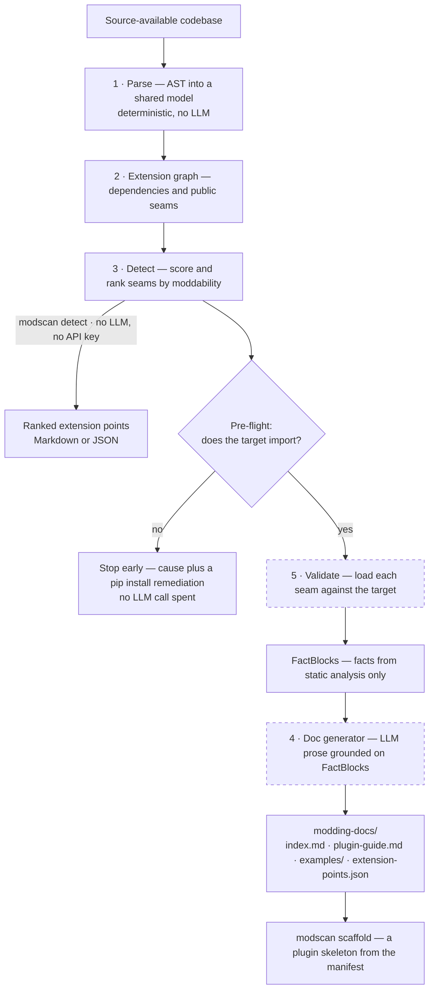

# MODScan

[](https://pypi.org/project/modscan/)
[](https://github.com/Rinkia/modscan/actions/workflows/ci.yml)
[](LICENSE)
[](pyproject.toml)

**Scan a codebase, get everything you need to write plugins and mods for it.**

MODScan reads a source-available project, finds where it can be *extended* —
hooks, event systems, dynamic loading, dependency injection, config-driven
behavior — and generates modding/plugin documentation grounded in real static
analysis. It doesn't just describe the code (Doxygen already does that); it maps
the **seams** a modder actually hooks into, then writes a "how to build a plugin"
guide and a **working example plugin that it validates by loading it for real**.

> Status: **v0.1.0 (pre-release).** The full pipeline works end to end for
> Python, with experimental TypeScript/JavaScript support. The extension-point
> *ranking* is the rough edge — on large codebases it surfaces plausible but
> low-value seams. See the [open issues](https://github.com/Rinkia/modscan/issues)
> if you want to help sharpen it.

---

## Why

Great mods and plugins have turned plain games and apps into masterpieces. But
getting started modding a project is painful: you have to reverse-engineer the
architecture yourself to find where you're even allowed to plug in. MODScan
automates that discovery step.

## What makes it different

Existing tools generate API docs from source. MODScan focuses on the hard,
valuable part everyone skips: **extension-point discovery**.

- Detects hooks, event/callback systems, dynamic import / plugin discovery,
  registration decorators, subclassable interfaces (ABCs / Protocols), and
  config/data-driven behavior.
- Ranks seams by how *moddable* they are.
- Grounds all generated docs in static analysis — **facts come from the parser,
  prose comes from the LLM, nothing is invented.**
- Closes the loop: the example plugin it generates must actually load into the
  target for the docs to be considered correct.

## How it works



Facts come from the parser, prose from the LLM, correctness from the validator.
Layers 1–3 are deterministic and verifiable; the LLM (layer 4) only ever sees the
structured FactBlocks, never raw source, so it explains what the analysis found
rather than inventing it. The Validator (layer 5) is built *before* the doc
generator, so every later stage is measurable against a plugin that really loads.

The dashed stages **import and execute target code** — that is where a real
plugin is loaded to prove a seam. Run only on code you trust; `--sandbox`
contains it in a child process, and `--no-validate-examples` skips execution
entirely (and, with it, the pre-flight probe).

## Scope (MVP)

| In scope | Out of scope (for now) |
|---|---|
| Source-available codebases | Closed binaries / reverse engineering |
| Python (first target) | Every language at once |
| Core library + thin CLI | Web app / SaaS UI |

> **Note on closed / binary apps.** Modding a compiled, closed-source
> application (a typical commercial game) means decompilation and reverse
> engineering, which carries real legal implications (EULA, DMCA). That is
> deliberately **out of the MVP**. MODScan starts with code you are allowed to
> read and modify.

## Languages

Python is the primary, fully-integrated target. **TypeScript/JavaScript parsing
is experimental** (via tree-sitter): it feeds the graph and detector, so
extension points and docs work, but example *execution*-validation is Python-only
for now. Install with `pip install modscan[typescript]`; the front-end registers
under `typescript` and `javascript`.

## LLM providers

The doc generator is provider-agnostic. Pick your model; SDKs are optional deps
imported lazily, so you install only what you use. API keys come from env vars,
never hardcoded.

| Provider | Install | Covers |
|---|---|---|
| `anthropic` (default) | `pip install modscan[anthropic]` | Claude (default model: `claude-opus-4-8`) |
| `openai` | `pip install modscan[openai]` | OpenAI, plus any OpenAI-compatible endpoint via `base_url`: Gemini, OpenRouter, DeepSeek, Mistral, local Ollama / LM Studio |
| `gemini` | `pip install modscan[gemini]` | Google Gemini (native SDK; also reachable via the `openai` adapter + `base_url`) |

## Output

Two artifacts, one for humans and one for tools:

- `modding-docs/*.md` — architecture overview + per-seam plugin guide with a
  validated example plugin.
- `modding-docs/extension-points.json` — a versioned, machine-readable manifest
  of every validated extension point. This is the contract that will power
  `modscan scaffold <id>`, editor tooling, and breaking-change diffs.

Every generated example is re-loaded against the target to confirm it works;
ones that can't be validated are clearly marked `unverified`.

## Roadmap

1. ✅ AST parser + extension graph (Python)
2. ✅ Extension detector + moddability ranking
3. ✅ Validator — load a real example plugin against a detected seam
4. ✅ Doc generator (LLM, grounded) — Markdown + JSON manifest
5. ✅ `modscan ./path` CLI wrapper, end to end
6. ✅ `modscan scaffold <id>` — generate a plugin skeleton from the JSON manifest
7. ✅ TypeScript/JavaScript front-end (experimental), breaking-change diffs,
   sandboxed validation, spend controls
8. ✅ `modscan detect` (offline ranking), GitHub Action, and MCP server

See **[ROADMAP.md](ROADMAP.md)** for what's next, an honest account of where the
ranking works and where it doesn't (measured across six real packages), and how
to contribute.

## Try it in 30 seconds (no API key)

`modscan detect` ranks a codebase's extension points using static analysis only
— no LLM, no API key, no code execution. It is the fast way to see what MODScan
finds before committing to a full documentation run. *(Requires modscan ≥ 0.1.1.)*

```bash
pip install modscan
modscan detect ./path/to/project            # ranked Markdown table
modscan detect ./path/to/project --json     # machine-readable, for tooling/CI
modscan detect ./path/to/project --limit 10 # just the top 10
```

Point it at an installed package to see it work immediately:

```bash
modscan detect "$(python -c 'import os,click;print(os.path.dirname(click.__file__))')" --limit 5
```

### In CI (GitHub Action)

Drop the ranked extension points into every pull request's job summary — safe on
untrusted PRs, since `detect` runs no LLM and executes no target code:

```yaml
- uses: actions/checkout@v4
- uses: Rinkia/modscan@v0.1.3
  with:
    path: .
    min-score: "0.5"
```

### Breaking-change gate for your plugin API

If your library has plugin/mod authors, guard them from silent breakage: fail a
pull request that **removes or changes an extension point**. It diffs `detect` on
the PR against the base branch — no committed manifest, no LLM, no API key.

```yaml
# .github/workflows/extension-api.yml
on: pull_request
permissions: { contents: read, pull-requests: write }
jobs:
  gate:
    runs-on: ubuntu-latest
    steps:
      - uses: actions/checkout@v4
        with: { fetch-depth: 0 }        # the gate needs the base branch
      - uses: Rinkia/modscan/breaking-change@v0.1.3
        with: { path: your_package }
```

On a PR it comments the diff and fails the check when an extension point is gone
or its category/kind changed. A score/ranking change alone is not breaking.
(MODScan uses this on itself — see `.github/workflows/extension-api-gate.yml`.)

### From an AI client (MCP server)

Ask an MCP-capable client (Claude Desktop, Cursor, …) "what are the extension
points of this codebase?" without leaving the conversation. The server exposes
only the offline detector — no LLM, no code execution — so it is safe on any
local checkout.

```bash
pip install modscan[mcp]
modscan-mcp        # stdio server; register the `modscan-mcp` command with your client
```

The one tool, `detect_extension_points_tool`, takes a path and returns the ranked
points. *(Requires modscan ≥ 0.1.1.)*

## Full documentation run (uses an LLM)

```bash
pip install modscan[anthropic]     # or [openai], [gemini], [typescript]
export ANTHROPIC_API_KEY=sk-...    # keys come from the environment, never flags

modscan ./path/to/project
# -> writes modding-docs/: index.md, plugin-guide.md, examples/*.py,
#    and extension-points.json
```

Common flags:

```bash
modscan ./proj --provider openai --model gpt-x --base-url http://localhost:11434/v1
modscan ./proj --min-score 0.6 --limit 20 --retries 5
modscan ./proj --language typescript     # scan a TS/JS codebase (static docs)
modscan ./proj --no-validate-examples   # skip importing/executing target code
modscan ./proj --sandbox                 # validate examples in an isolated subprocess
modscan ./proj --cache-dir .modscan-cache  # cache LLM responses for cheap re-runs
modscan ./proj --max-tokens 2048 --max-calls 50   # spend controls: per-call cap + hard run ceiling
modscan ./proj --concurrency 8           # parallel LLM calls (the main speed-up)
```

Then scaffold a ready-to-edit plugin from any documented extension point (no LLM,
reads the JSON manifest):

```bash
modscan scaffold "pkg.mod:Symbol" --manifest modding-docs/extension-points.json
# -> writes pkg_mod_Symbol_plugin.py: a concrete subclass with stubbed methods

modscan scaffold --all --out plugins/   # skeletons for every documented point
```

Diff two manifests to catch breaking changes when the target app updates (exits
non-zero on breaking changes — handy as a CI gate):

```bash
modscan diff old/extension-points.json new/extension-points.json
```

To gate pull requests automatically, copy
[`examples/ci/breaking-change.yml`](examples/ci/breaking-change.yml) into your
project: it diffs the committed manifest against the PR's base branch, comments
the result on the PR, and fails the check on breaking changes. No API key needed.

> **Trust note:** by default MODScan imports and executes code under the scanned
> path (and runs generated examples) to validate that plugins really load. Run it
> only on code you trust, or pass `--no-validate-examples`.

## Contributing

Contributions welcome — MODScan is designed to be easy to extend. Start with
[CONTRIBUTING.md](CONTRIBUTING.md), then pick up a
[**good first issue**](https://github.com/Rinkia/modscan/issues?q=is%3Aissue+is%3Aopen+label%3A%22good+first+issue%22).

Each layer is a clean seam you can extend on its own:

- **New detection heuristics** — add hook/registration name patterns or class
  role suffixes in `detector.py`.
- **New languages** — implement a `LanguageParser` (see `languages/`) that emits
  the shared `Codebase` model; the graph, detector, and docs come for free.
- **New LLM providers** — add a thin adapter under `providers/`.

Tests are framework-free and offline (`python tests/test_*.py`) — no API key, no
network. The golden rule: facts come from the parser, prose from the LLM.

## License

[Apache License 2.0](LICENSE). Permissive, with an explicit patent grant — the
extension-point detection is the core value, so the patent clause is worth the
extra verbosity. See also [`NOTICE`](NOTICE).

---

*Planning docs live in [`.claude/plans/modscan.plan.md`](.claude/plans/modscan.plan.md).*
